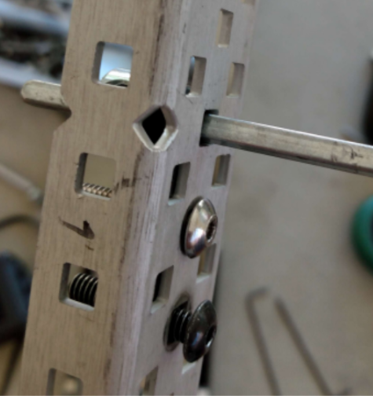
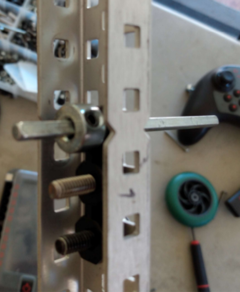
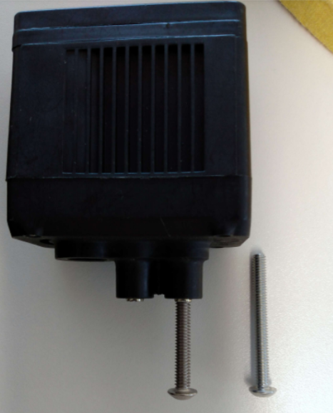

---
name = "Installing a Motor"
description = "In this document, we install a motor onto a C-channel, and then control it with a built-in VEX program."
---

## Step 1

Gather the necessary parts. See the Step 5 image for VEX electronics:

- VEX Motor
- VEX CORTEX
- VEX Controller
- VEX Radio
- Wires (x3)
- Battery and battery cable
- C-channel (size doesn’t matter)
- Toolbox
  - Flat Bearing
  - Shaft collars
  - Screws of assorted sizes
- Wheel (any size)

Tools you will need:

- 3/32’’ and 5/64’’ screwdrivers
- 3/32’’ and 5/64’’ allen wrenches (optional, but they help)

## Step 2

Place a flat bearing inside the C-channel with 2 screws and an axle. Place a shaft collar on the inside of the C-channel, on the axle. See the note below about choosing screw length for motors.
|  |  |
| - | - |

### Note: Choosing screw length for motors

| C |  |
| Choose a screw that will have enough room to bury deep in the motor, but not too deep. Try taking a long screw, like the one in the image at right, and spin it into a motor screw slot with your hand only. As a rule of thumb, as soon as you have to use your screwdriver to drive the motor screw, you are probably going too far (or the screw thread is bad). The image at right shows the maximum amount that the screw should go into the motor. | - |
