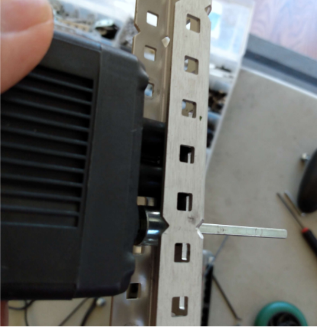
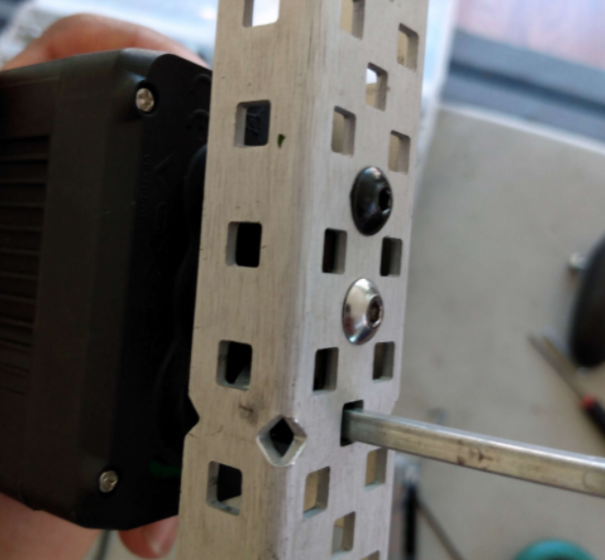
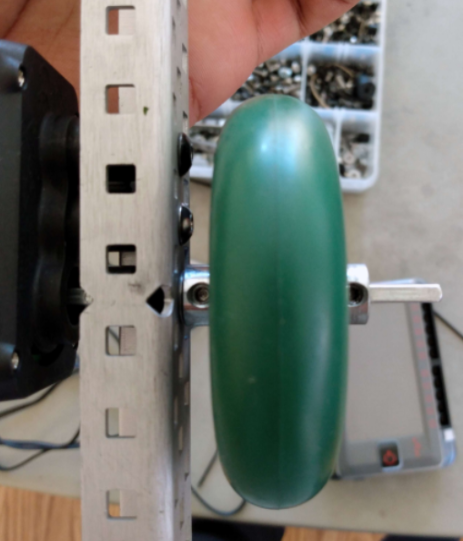
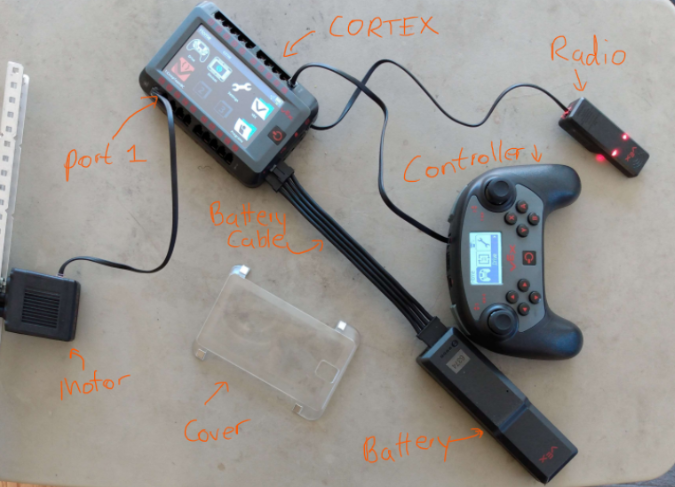
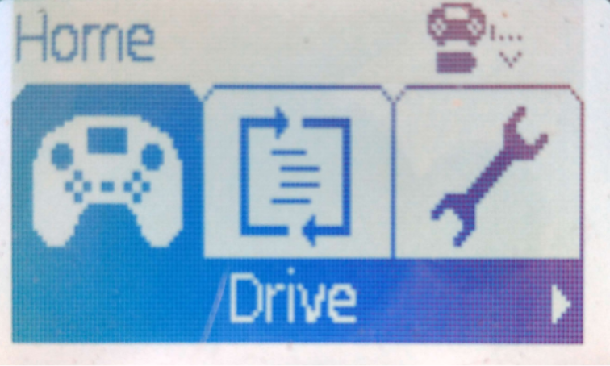
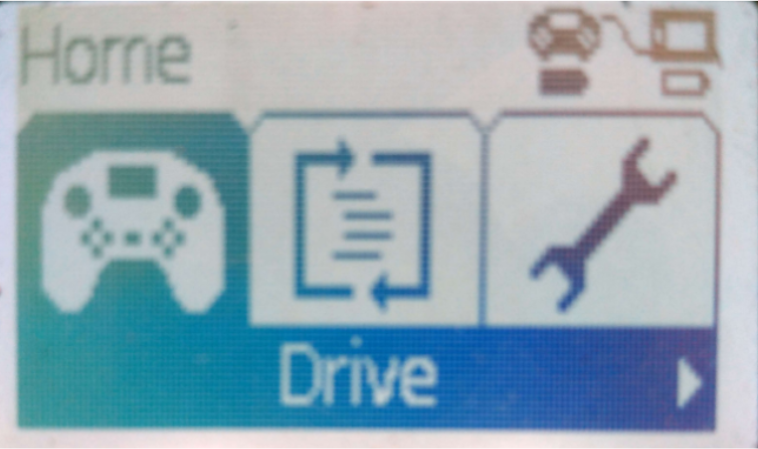
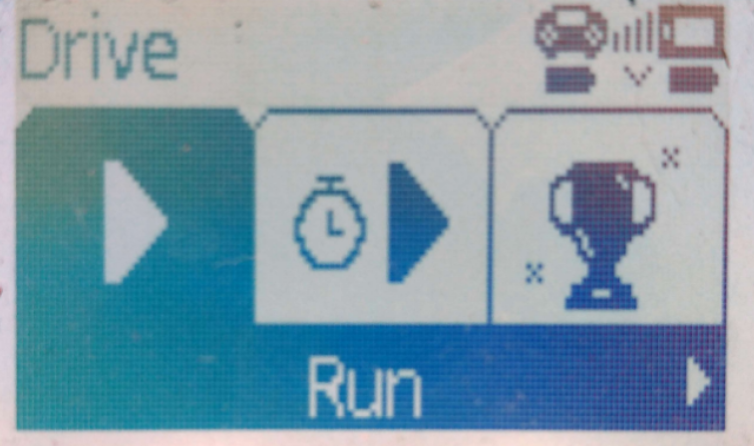
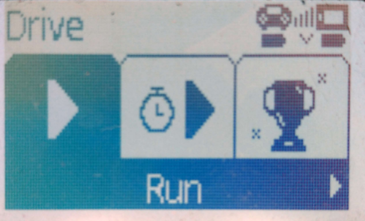
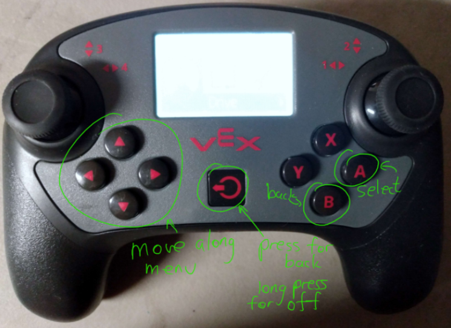
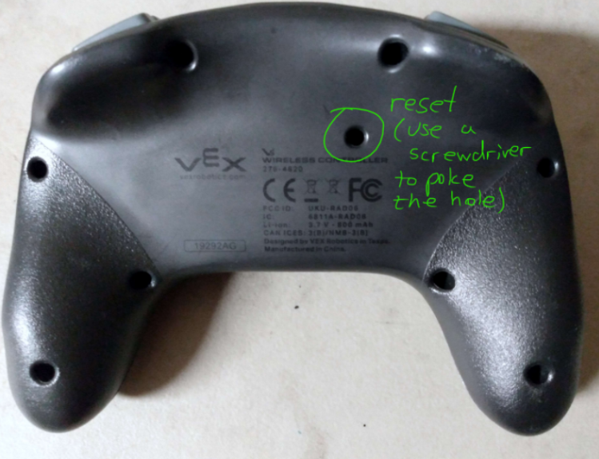

---
name = "Installing a Motor"
description = "In this document, we install a motor onto a C-channel, and then control it with a built-in VEX program."
---

## Step 1

Gather the necessary parts. See the Step 5 image for VEX electronics:

- VEX Motor
- VEX CORTEX
- VEX Controller
- VEX Radio
- Wires (x3)
- Battery and battery cable
- C-channel (size doesn’t matter)
- Toolbox
  - Flat Bearing
  - Shaft collars
  - Screws of assorted sizes
- Wheel (any size)

Tools you will need:

- 3/32’’ and 5/64’’ screwdrivers
- 3/32’’ and 5/64’’ allen wrenches (optional, but they help)

## Step 2

Place a flat bearing inside the C-channel with 2 screws and an axle. Place a shaft collar on the inside of the C-channel, on the axle. See the note below about choosing screw length for motors.

  

  

### Note: Choosing screw length for motors

  

Choose a screw that will have enough room to bury deep in the motor, but not too deep. Try taking a long screw, like the one in the image at right, and spin it into a motor screw slot with your hand only. As a rule of thumb, as soon as you have to use your screwdriver to drive the motor screw, you are probably going too far (or the screw thread is bad). The image at right shows the maximum amount that the screw should go into the motor.

## Step 3

Align the motor so that the screw slots fit with the screws you placed in the previous step. Tighten the screws into the motor. Place the axle inside the motor’s square-shaped hole. It should be difficult to spin the bare axle with your free hand; when you spin the axle, you should hear motor spinning noises.

While lightly pushing the collar on to the bearing, tighten the shaft collar. The axle should be “frozen” in place by the collar; you shouldn’t be able to pull the axle out. This is the entire purpose of the shaft collar!

  

  

## Step 4

Place the parts in the given order along the axle:

1. Washer (ideally plastic, but since we don’t have many of those, we usually use metal instead)
2. Collar
3. Wheel
4. Collar

The wheel should be “sandwiched” by collars. This ensures that the wheel can’t move along the axle when the motor spins. One collar should be separated from the C-channel by a washer. This reduces metal-on-metal contact, thereby reducing friction.

  

## Step 5

Wire up your motor to the VEX electronics! Be sure to connect the motor to port 1. It doesn’t matter which ports the controller and radio are connected to. The Radio should have its red lights on.

  

## Step 6

Turn on the CORTEX and controller. After the controller connects to the CORTEX with a wire, disconnect the wire connecting the controller and CORTEX. The controller should automatically switch to a wireless connection with the CORTEX.

  

The controller is looking for a CORTEX.

  

The controller is wired to the CORTEX.

  

The controller is wirelessly controlled to the CORTEX, via the radio. This is usually how the controller should be set up.

## Step 7

Select the “Drive” program on your controller (see the note below). Then hit Run, and you are done! You should be able to control the motor with the left joystick.

  

### Note: Controlling the Controller

Refer to the images below for a quick controller overview. Use the reset button if the controller ever freezes up.

  

  

