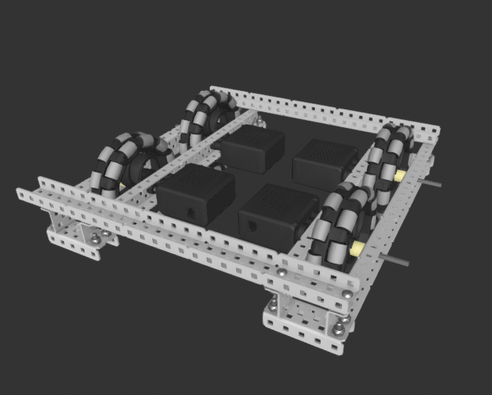

---
name = "Building a Drivetrain"
description = "In this module, we build a 4 wheel drive, tank-style drivetrain. This is the standard way to build a drivetrain that you will probably use in competition."
---

## What you will build

The final product will look something like this:

## Step 1

Gather the necessary parts:

- VEX Motors (x2)
- VEX CORTEX
- VEX Controller
- VEX Radio
- VEX Wires (x4)
- decently long C-channels (at least 25 holes long) (x6)
  - at least 4 of these should be of exactly the same length
- a 5-wide (at least 15 holes long, same length as the C-channels above)
- shorter C channels (5 holes long) (x4)
- battery and battery cable
- toolbox
  - flat bearing
  - shaft collars
  - screws
  - standoffs (3/4 in) (x4)

### Note: C Channels

C channels have grooves on the sides that indicate a group of 5 holes. This way, you can quickly count 4 grooves = 4\*5 holes = 20 holes instead of counting each hole individually.

For this activity, make sure you have two pairs of C-channels with the same length. (You will eventually make a rectangular structure for the drivetrain)

## Step 2

Attach a motor to one of the longer C channels. Place an omniwheel on this motor. You can follow the instructions in the previous module titled "Putting on a Motor". Be sure to leave enough space for a future structural element. Also be sure to screw in the motor before putting anything else in. As in the picture below, your motor axle should be at least the 7th hole from the last center hole. Place the bearing flat so that the most of the motor faces inside the robot, rather than outside.

Remember to place omniwheels on the axles (not small traction wheels).

## Step 3

When we installed a motor in the last module ('Installing a Motor'), the axle had one point of support. That was okay, since the wheel didn't have to support any load. 

Now, since your wheels are supporting the weight of your robot, you need ***two*** points of support for your axles. This is a general rule in VEX: always support your axles in two places (at least). Only one point of support causes undue friction and stress on the axle. 

Add these parts to the axle in the following order:
1. large spacer (3/8 in)
2. washer
3. C channel (same length as the other one, 25 holes)

Then, add the short C channel (5 holes long) to both sides of the assembly. It should look like this from the top:

Finish the assembly off with a washer and collar at the end of both axles. As in the previous module, make sure the washer is between the collar and the C channel (to reduce friction).

## Step 4

Make another set of wheels (repeat Step 3). You will connect these two sets in the next step. Just make sure to put the short C channels on the opposite side as before, since this assembly will be rotated upside down to match with the other one.

## Step 5

Connect the two sets of wheels with C channels. The connecting C channels should be at least 25 holes wide. **Make sure exactly two holes sticks out of the bot** (for alignment reasons). 

## Step 6

Now, we can place the CORTEX on the robot. Get the 5-wide C channel exactly 15 holes wide. Connect the CORTEX to the 5-wide with 4 screws.

## Step 7

Screw 4 standoffs to the bottom of the 5-wide. The standoffs enable the CORTEX to face upward instead of downward when the CORTEX is connected to the robot. Also make sure the standoffs are at least 3/4 in long; this assembly needs to "rise" above the motors. 

## Step 8

Screw this 5 channel to the robot.

Congrats, you have built a (hopefully) functional drivetrain! Move on to "Coding your Drivetrain" to enable it to move with your controller!