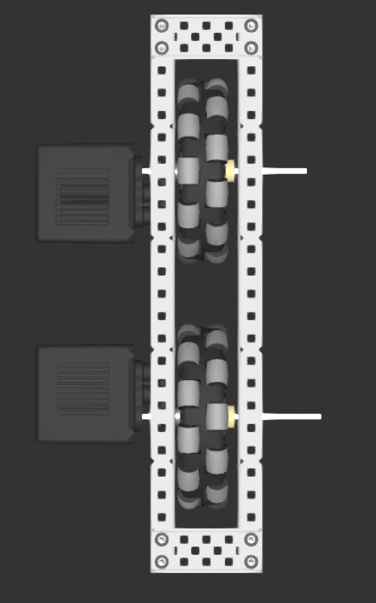
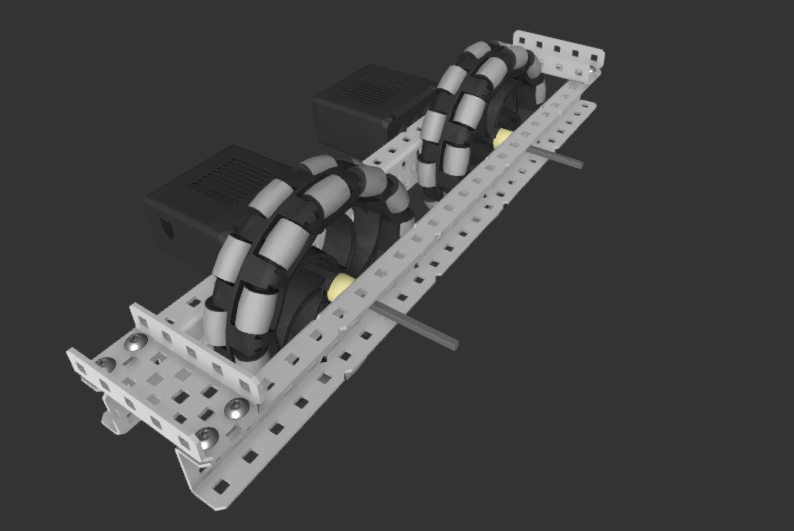
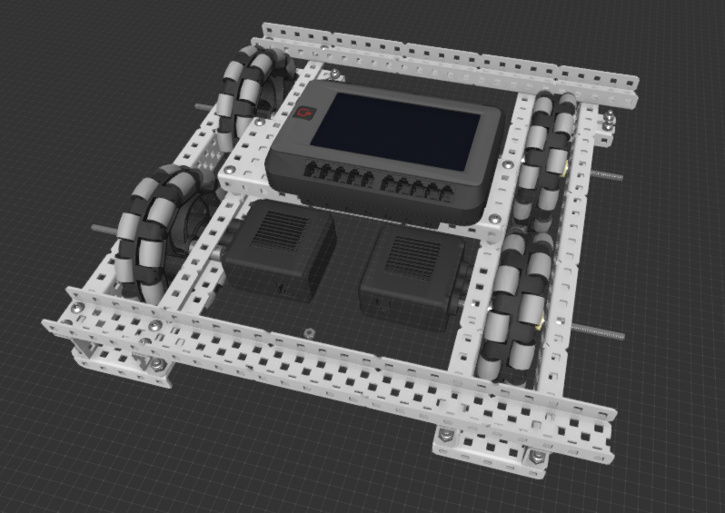

---
name = "Building a Drivetrain"
description = "In this module, we build a 2 wheel drive, tank-style drivetrain. This is the standard way to build a drivetrain that you will probably use in competition."
---

## What you will build

The final product will look something like this:

## Step 1

Gather the necessary parts:

- VEX Motors (x2)
- VEX CORTEX
- VEX Controller
- VEX Radio
- VEX Wires (x4)
- decently long C-channels (at least 25 holes long) (x2)
- other C-channels (at least 15 holes long) (x2)
- a 5-wide (at least 15 holes long, same length as the "other C-channels" above)
- battery and battery cable
- toolbox
  - flat bearing
  - shaft collars
  - screws

### Note: C Channels

C channels have grooves on the sides that indicate a group of 5 holes. This way, you can quickly count 4 grooves = 4\*5 holes = 20 holes instead of counting each hole individually.

For this activity, make sure you have two pairs of C-channels with the same length. (You will eventually make a rectangular structure for the drivetrain)

## Step 2

Attach a motor to one of the longer C channels. Place an omniwheel on this motor. You can follow the instructions in the previous module titled "Putting on a Motor". Be sure to leave enough space for a future structural element.

As in the picture above, your motor axle should be at least the 4th hole from the last center hole. You will eventually place a perpendicular C-channel with the extra space you leave (see image below).

Remember to place an omniwheel on the axle (not a small traction wheel).

## Step 3

Place another wheel on the same C channel. Remember that the motor axle should be at least the 4th hole from the last center hole on the C channel.

## Step 4

Make another set of wheels. You will connect these two sets in the next step.

## Step 5

Connect the two sets of wheels with C channels. The connecting C channels should be at least 15 holes wide.

## Step 6

Now, we can place the CORTEX on the robot. Find a 5-wide C-channel at least as long as the connecting pieces you attached in the last step. Connect the CORTEX to the 5-wide with 4 screws.

## Step 7

Screw 4 standoffs to the bottom of the 5-wide. The standoffs enable the CORTEX to face upward instead of downward when the CORTEX is connected to the robot.

## Step 8

Screw this 5 channel to the robot.

The below picture is taken from the robot's underside.

