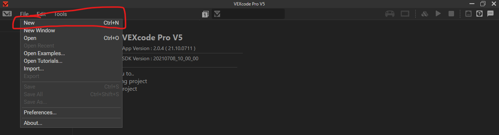
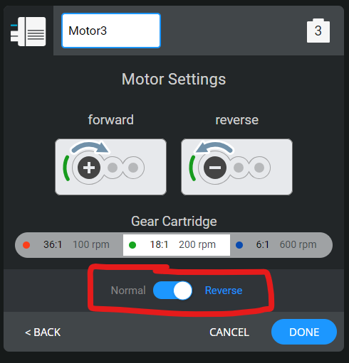

---
name = "Coding the Drivetrain"
description = "In this document, we upload a basic program to a pre-built drivetrain to make the robot move with driver control! If you haven't built the drivetrain already, refer to 'Building a Drivetrain'."
---

## Introduction

In this module, we program a drivetrain so that you can control it with the controller. We are going to do this with two different softwares: VEXCode Pro v5 (the official editor) and the VEX PROS API (an open-source, well-documented, highly functional API). 

If you plan on coding for a VEX competition and have some prior coding experience, I'd recommend skipping to the "PROS" section of this module, so that you know how to use that approach. In general, the PROS API definitely has more features and is more advanced than the official API. The documentation is also pretty impressive compared to the official editor. 

However, if you are a beginner to coding in general, I'd stick with the VEXCode Pro v5 approach for now. It's a little easier to learn, and sets you up to learn the PROS API if you want to. Once you feel you can use the official editor a little bit, you can always come back to this module to learn the PROS approach (it's really not that different at this level).

Without further ado, let's get going!

# With VEXCode Pro v5
## Step 1

Gather materials:

- a computer with [VEXCode **_Pro_** v5](https://www.vexrobotics.com/vexcode/install/v5) installed
- an upload cable
  - not all microUSB cables can work as an upload cable; the cable must be "data carrying".
- a built drivetrain

## Step 2

Click "File" on the top navbar, then hit "New".



## Step 3

Click the motor icon on the top right; then click "Add a device".


Add a "Controller", then click "DONE".


## Step 4

Add a motor by clicking "Add a Device" again, then selecting "MOTOR".


\
Select a port (doesn't matter for now), then name the motor "left_motor" by clicking the text field near the top. Finally, click "DONE". You should see the port number of left_motor near its name.


\
Add another motor named "right_motor" with the same process outlined above. **Reverse the direction of the motor** by clicking the toggle switch (see image below). You should have two motors and a Controller in your "Robot Configuration" list.

**If you have a 4 wheel drive, you have to configure two extra motors.** Name them whatever you want; you will have to write code to match these names. 

It's generally good practice to configure every motor individually rather than configuring a "motor group"; you can get more functionality. 




### Coding Note: Why reverse motors?
On every v5 motor, you will see a plus icon with a circular direction indicated. This is the default positive orientation of the motor. When a positive percent value is passed to the motor, the motor will spin in the indicated direction by default. 


When you move a joystick forward, all wheels should spin in the same direction (forward). However, the positive orientations of the left wheels are actually in the *opposite direction* to the right wheels! This means that passing a positive percentage value to both sides will result in both sides spinning in opposite directions.

We could just invert the percent value of the joystick (multiply by -1) and pass this inverted value to one side. However, a more elegant solution is to just "reverse" one side of the motors, thus reversing the positive orientation of one side. Now, a positive percentage value will spin both sides of the motor in the same direction (yay!). 

(exactly the same logic applies for negative percentage values as well)
## Step 5

Locate the `main` function in the code. The function starts with `int main() {` and ends with a `}` character. Place your cursor inside the `main` function, after the `vexcodeInit();` command.


Paste the following code inside the `main` function, at your cursor:

```cpp
while (true) {
  left_motor.spin(forward, Controller1.Axis3.position() * drivetrain_dampening, percent); //spin drivetrain
  right_motor.spin(forward, Controller1.Axis2.position() * drivetrain_dampening, percent);
  wait(100, msec);
}
```

You should get a red underline under `drivetrain_dampening`; when hovering, an error pops up that `[clang] Use of undeclared identifier 'drivetrain_dampening'`. This error basically says that we haven't defined the `drivetrain_dampening` variable yet (if you don't know what variables are, don't worry about it for now).


Define the `drivetrain_dampening` outside of the `main` function with this code:

```cpp
float drivetrain_dampening = 1;
```

Your full `main.cpp` file should now look like this:

```cpp
#include "vex.h"

using namespace vex;

float drivetrain_dampening = 1;

int main() {
  // Initializing Robot Configuration. DO NOT REMOVE!
  vexcodeInit();
  while (true) {
    left_motor.spin(forward, Controller1.Axis3.position() * drivetrain_dampening, percent); //spin drivetrain
    right_motor.spin(forward, Controller1.Axis2.position() * drivetrain_dampening, percent);
    wait(100, msec);
  }
}
```

The bit inside the `main` function tells the robot motors to spin according to your `Controller1` axis values; a Controller "axis" is just a way to move the joystick (e.g. up and down on the left joystick, left to right on the right joystick, up and down on the right joystick, etc.)


### Note: 4 wheel drive

If you have a 4 wheel drive, you just have to add a few more function calls to spin the other two motors. 

Suppose you have two other motors, in addition to the `left_motor` and `right_motor` configured above; let's call them `left_back_motor` and `right_back_motor`. 

Inside the while loop, we have to tell the `left_back_motor` to spin:

```cpp
  left_back_motor.spin(forward, )
```
Since this a motor on the *left* side of the bot, we want to use the axis 3 value to control that motor; axis 3 is on the *left* side of the controller. 

The axis numbers are indicated in the Controller configuration:


We add to our code:
```cpp
  left_back_motor.spin(forward, Controller1.Axis3.position() * drivetrain_dampening, percent);
```

A similar command for the right motor might look like:

```cpp
  right_back_motor.spin(forward, Controller1.Axis2.position() * drivetrain_dampening, percent);
```

Notice how we used axis 2 instead, since that axis is on the right side of the controller. 

For a 4 wheel drive, your full `main.cpp` file should look something like this:

```cpp
  #include "vex.h"

using namespace vex;

float drivetrain_dampening = 1;

int main() {
  // Initializing Robot Configuration. DO NOT REMOVE!
  vexcodeInit();
  while (true) {
    //spin front motors
    left_motor.spin(forward, Controller1.Axis3.position() * drivetrain_dampening, percent); 
    right_motor.spin(forward, Controller1.Axis2.position() * drivetrain_dampening, percent);

    //spin back motors
    left_back_motor.spin(forward, Controller1.Axis3.position() * drivetrain_dampening, percent);
    right_back_motor.spin(forward, Controller1.Axis2.position() * drivetrain_dampening, percent);
    wait(100, msec);
  }
}
```

## Step 6

Now the fun bit -- uploading your code and testing!

- **Plug in the motors to the ports you configured them to.** For instance, if you configured the `left_motor` to be on port 3, then connect the left motor to port 3.
- Turn on your CORTEX and plug in the upload cable to both your computer and the CORTEX.
- The buttons on the top right of the screen should change to show that your robot was plugged in. Find the Upload/Download button and click it.
- After the program is uploaded, it should show up in the list of programs on the CORTEX.

## Step 7

Run the drivetrain program, and you should be able to control the drivetrain with your joysticks!

If the drivetrain is too fast, you can lower the `drivetrain_multiplier`. Just keep it in the half-open interval (0,1].

# With PROS API

## Step 1

Follow [this PROS documentation page](https://pros.cs.purdue.edu/v5/getting-started/index.html) to install VSCode and the PROS VSCode extension.

Click the PROS extension menu on the sidebar, then click "Create Project". Select "v5" as the target device, and select the latest version. 


## Step 2

Find the `main.cpp` file in the `src` directory (`src/main.cpp`); then find the `opcontrol()` function towards the end of the file. 


## Step 3

Change the `opcontrol` function to the following (just copy/paste):

```cpp
void opcontrol() {
  pros::Motor left_wheels (LEFT_WHEELS_PORT);
  pros::Motor right_wheels (RIGHT_WHEELS_PORT, true); // This reverses the motor
  pros::Controller master (CONTROLLER_MASTER);

  while (true) {
    left_wheels.move(master.get_analog(ANALOG_LEFT_Y));
    right_wheels.move(master.get_analog(ANALOG_RIGHT_Y));

    pros::delay(2);
  }
}
```
## Step 4

Define the left and right motor ports just outside the `opcontrol` function. If you have a 4 wheel drive, you need to define 4 ports.

```cpp
#define LEFT_WHEELS_PORT 1
#define RIGHT_WHEELS_PORT 10

void opcontrol() {
  //...the stuff you pasted in before
}
```

## Step 5: adding more motors

Just like in the VEXCode Pro approach, we can first add more motor ports for 4 wheel drive. Let's say we also had a `LEFT_BACK_WHEEL_PORT`; then define another port with 
```cpp
#define LEFT_BACK_WHEEL_PORT 3
``` 
outside of the `opcontrol` function.


Now, we have to define the motor object near the start of the `opcontrol` function with 
```cpp
pros::Motor left_back_wheels (LEFT_BACK_WHEEL_PORT);
```


 Then, inside the while loop of the `opcontrol` function, write the command to make that motor spin with the corresponding controller axis:

 ```cpp
left_back_wheel.move(master.get_analog(ANALOG_LEFT_Y));
 ```

## Step 6

Now the fun bit -- uploading your code and testing!

- **Plug in the motors to the ports you configured them to.** For instance, if you configured the `left_motor` to be on port 3, then connect the left motor to port 3.
- Turn on your CORTEX and plug in the upload cable to both your computer and the CORTEX.
- To upload your code, hit the "Build and Upload" quick action on the PROS extension menu (towards the left).
- After the program is uploaded, it should show up in the list of programs on the CORTEX.

Your drivetrain should hopefully be running with driver control now!
 